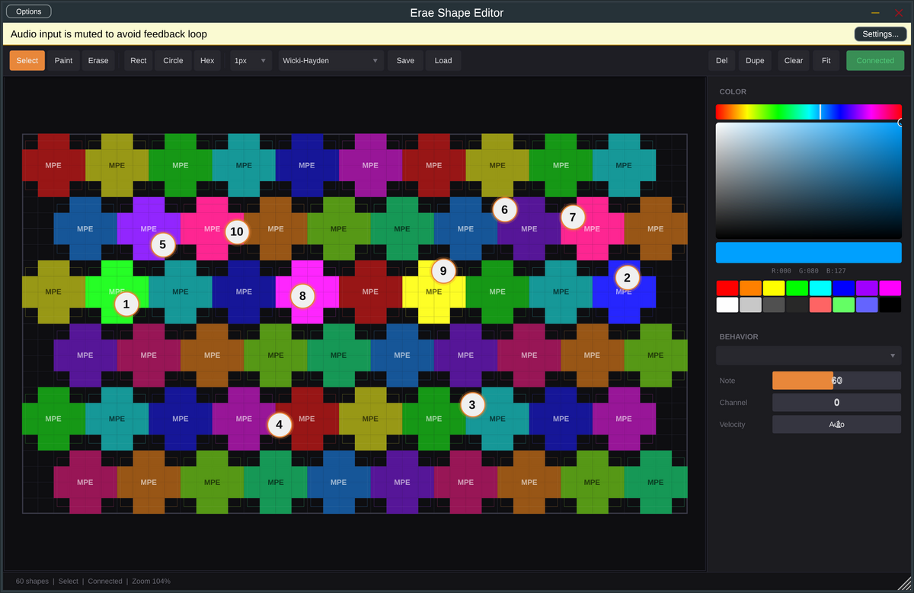

# Erae 2 API Interface

> **Work in Progress** - This project is under active development. Features may change and contributions are welcome.

A JUCE-based visual layout editor and MIDI controller for the **Erae Touch II** playing surface. Design custom touch layouts with shapes, colors, and behaviors, then send them directly to the Erae hardware over USB.



## What It Does

- **Visual Layout Editor** - Design touch-sensitive zones on a 42x24 grid that maps 1:1 to the Erae Touch II LED surface
- **Real-time Hardware Rendering** - Layouts are pushed to the Erae surface as RGB pixel data via SysEx, with animated visual feedback (pressure glow, fill bars, position dots, radial arcs)
- **MIDI Generation** - Each shape can be assigned a MIDI behavior (trigger, momentary, note pad with MPE, XY controller, fader) that generates MIDI from finger touch events
- **Finger Tracking** - Receives finger position data from the Erae II fingerstream API and dispatches touch events to the appropriate shapes
- **Undo/Redo** - Full command-pattern undo/redo for all editing operations, with drag coalescing so a single undo step reverses an entire drag
- **Multi-Select & Alignment** - Shift+click to multi-select shapes, then align (left/right/top/bottom/center) or distribute evenly. Clipboard copy/cut/paste with Ctrl+C/X/V
- **Multi-Page Layouts** - Organize shapes across multiple pages with page navigation; JSON format auto-detects v1 (single page) and v2 (multi-page)
- **Musical Features** - Velocity curves (linear/exponential/logarithmic/S-curve), scale quantization (10 scales with glide), note latch, pressure curves, CC output ranges
- **OSC Output** - Mirror all MIDI output as OSC messages over UDP for integration with TouchDesigner, Max/MSP, SuperCollider, etc.
- **Per-Finger Colors** - Each finger gets a distinct color (10-color palette) on both the screen overlay and hardware surface
- **DAW Feedback** - Incoming MIDI note-on/off from the DAW highlights the corresponding shapes with a pulsing glow, so pads light up during playback
- **Preset Library** - Built-in presets (Drum Pads, Piano, Wicki-Hayden, Fader Bank, XY Pad, Buchla Thunder, Auto Harp) plus save/load of custom layouts as JSON
- **Shape Library** - Save any shape to a persistent reusable library. Browse saved shapes, place them on the canvas, flip horizontally/vertically. Library persists across sessions as JSON
- **CV Output** - Each shape can optionally output CV signals on audio channels (1V/oct pitch, gate, pressure, slide). Designed for bridging to modular synths via DC-coupled audio interfaces or FPGA USB audio (120-channel Zybo modular)
- **Tabbed Sidebar** - Right sidebar organized into 4 tabs: **Shape** (color picker, visual style, alignment, morph), **MIDI** (behavior, note/CC, learn, curves, scales), **Output** (CV per-shape, OSC global), **Library** (browse, save, place, flip). Selection info stays visible at the bottom across all tabs
- **Runs as Standalone or VST3** - Use it as a standalone app or load it in your DAW

## Shape Types

- **Rectangle** - Axis-aligned rectangular zones
- **Circle** - Circular touch areas
- **Hexagon** - Regular hexagonal pads (great for isomorphic layouts)
- **Polygon** - Arbitrary convex/concave polygons defined by vertices (used for parallelogram wings in the Buchla Thunder preset). Draw interactively with the **Poly** tool (P key): click vertices, double-click or Enter to close
- **Pixel** - Freeform shapes built by painting individual grid cells. Use the **Pixel** tool (G key): left-click/drag to paint, right-click to erase, Ctrl+Z to undo last stroke, Enter to finalize into a single shape

### Edit Shape Mode

Right-click any shape in Select mode and choose **Edit Shape** to enter edit mode. This lets you modify an existing shape's geometry directly:

- **Left-click/drag** to paint new cells onto the shape
- **Right-click/drag** to erase cells from the shape
- **Drag resize handles** (corners/edges) to scale the shape bigger or smaller
- All three actions are available simultaneously — no mode switching needed
- Non-pixel shapes (Rect, Circle, Hex, Polygon) are auto-converted to Pixel on first cell edit
- **ESC** or click far outside the shape to exit edit mode
- **Ctrl+Z** undoes the entire edit session in one step

## Visual Styles

Each shape can have an independent visual style that animates on the hardware surface:

- **Static** - Solid color fill (no animation)
- **Pressure Glow** - Color intensity tracks finger pressure
- **Fill Bar** - Vertical/horizontal fill level follows finger position
- **Position Dot** - Bright dot tracks finger position within shape
- **Radial Arc** - Arc sweeps based on finger angle from center

## Touch Effects

Each shape can run a real-time touch effect that drives animated visuals on both the 42x24 LED grid and the screen canvas, with optional MPE XYZ modulation output. Effects are configured per-shape with Speed, Intensity, Decay, and Motion Reactive parameters.

### Visual Effects (8 types)

| Effect | Description |
|--------|-------------|
| **Trail** | Fading trail follows finger motion |
| **Ripple** | Expanding rings from touch points |
| **Particles** | Fountain of particles from finger position |
| **Pulse** | Shape brightness oscillates while touched |
| **Breathe** | Slow sinusoidal brightness modulation |
| **Spin** | Dots orbit around the finger position |
| **Orbit** | Multi-finger: pivot + control radius/speed of orbiting elements |
| **Boundary** | Multi-finger: convex hull with filled interior |

### Physical Model Effects (11 types)

Physics simulations driven by multi-touch input. Each model's state variables map to MPE X/Y/Z for expressive MIDI control.

| Effect | Physics | Finger Interaction | MPE X/Y/Z |
|--------|---------|-------------------|------------|
| **String** | 1D wave equation (N=32) | 2 fingers = endpoints, 3rd = pluck | Pluck pos / midpoint displacement / energy |
| **Membrane** | 2D wave equation on grid | Strike at touch position, pressure = force | Peak displacement position / amplitude |
| **Fluid** | Navier-Stokes (Stam stable fluids) | Drag stirs velocity field, deposits dye | Density centroid / vorticity |
| **Spring Lattice** | Mass-spring grid network | Touch displaces nodes, propagates | Displacement centroid / energy |
| **Pendulum** | Single/double pendulum ODE | 1st finger = pivot, 2nd enables double | Bob position / angular velocity |
| **Collision** | Elastic balls with gravity | Touch spawns balls, wall/ball-ball bounce | Ball centroid / collision rate |
| **Tombolo** | Sandpile erosion/deposit automaton | Press deposits material, drag erodes | Mass centroid / total height |
| **Gravity Well** | N-body (fingers as masses) | Fingers attract orbiting particles | Particle centroid / orbital energy |
| **Elastic Band** | 20-point spring chain | Grab points, stretch, release snaps back | Band midpoint / tension |
| **Bow** | Stick-slip friction model | Drag = bow velocity, pressure = force | Bow position / friction force |
| **Wave Interference** | Superposition of circular waves | Each finger = wave source, velocity = frequency | Interference peak / amplitude |

### Modulation Targets

Effect state can be routed to any modulation target:

- **MIDI CC** - Effect value (0-1) mapped to a CC number
- **Pitch Bend** - Effect value mapped to 14-bit pitch bend
- **Channel Pressure** - Effect value as aftertouch
- **CV** - Effect value on an audio output channel
- **OSC** - Effect value mirrored over UDP
- **MPE XYZ** - Full 3-axis output: X = pitch bend, Y = CC74 slide, Z = pressure (3 CV channels for X/Y/Z)

## MIDI Behaviors

- **Trigger** - Note on/off on touch down/up. Supports fixed or pressure-mapped velocity, configurable velocity curve, and latch mode (toggle on/off per press)
- **Momentary** - Note on while held, off on release. Velocity and aftertouch pressure curves are independently configurable
- **Note Pad (MPE)** - Per-finger channel allocation with pitch bend (X), slide CC (Y), and pressure (Z). Optional scale quantization (chromatic, major, minor, pentatonic, blues, dorian, mixolydian, whole tone, harmonic minor) with adjustable glide between scale degrees
- **XY Controller** - Sends two CC values based on finger X/Y position. Supports 7-bit or 14-bit hi-res mode, with configurable min/max output range per axis
- **Fader** - Single CC value mapped to finger position along one axis (horizontal or vertical). Supports 7-bit or 14-bit hi-res, with configurable min/max output range

## Keyboard Shortcuts

| Shortcut | Action |
|---|---|
| Ctrl+Z | Undo |
| Ctrl+Shift+Z | Redo |
| Ctrl+A | Select all |
| Ctrl+C / X / V | Copy / Cut / Paste |
| Ctrl+D | Duplicate selection |
| Delete / Backspace | Delete selection |
| V / B / E / R / C / H / P / G | Select / Paint / Erase / Rect / Circle / Hex / Poly / Pixel tool |
| Enter | Finalize polygon or pixel shape |
| Escape | Cancel polygon/pixel creation, or exit Edit Shape mode |
| Right-click shape | Context menu with "Edit Shape" (in Select mode) |
| Arrow keys | Nudge selected shapes (Shift = 5px) |
| Scroll wheel | Zoom in/out |
| Middle-click drag | Pan canvas |

## Built-in Presets

| Preset | Description |
|--------|-------------|
| **Drum Pads** | 4x4 MPC-style trigger grid, chromatic coloring, channel 9 |
| **Piano** | 3-octave keyboard (white + black keys), MPE note pads |
| **Wicki-Hayden** | Isomorphic hex layout, +2 semitones per column, +7 per row |
| **Fader Bank** | 8 vertical CC faders with fill-bar visualization |
| **XY Pad** | Full-surface XY controller with position-dot tracking |
| **Buchla Thunder** | Recreation of the Buchla Thunder overlay (triggers, feathers, tail pads, hex palm pads) |
| **Auto Harp** | Omnichord-style layout: 36 chord buttons (12 keys x Maj/Min/7th) on channels 0-2, plus 42 chromatic strum strings (C3-F6) on channel 3. Natural keys are brighter/wider, sharps are narrower/darker. Strum across the strings to trigger harp-like arpeggios |

## Building

Requires CMake 3.22+ and a C++17 compiler. JUCE is fetched automatically via CMake's FetchContent.

```bash
mkdir build && cd build
cmake ..
cmake --build . -j$(nproc)
```

The standalone app will be at `build/EraeShapeEditor_artefacts/Debug/Standalone/Erae Shape Editor`.

## Erae Touch II Connection

The app auto-detects the Erae Touch II via its USB MIDI ports:
- **Output** (API commands): Sent to the "Lab" MIDI port
- **Input** (finger events): Received from the "Main" MIDI port

The Erae II SysEx API is used for:
- Enabling/disabling the API mode
- Drawing pixels and images to the LED surface
- Receiving finger position/pressure data
- Querying zone boundaries

## OSC Output

When enabled, all MIDI output is mirrored as OSC messages over UDP (configurable host:port). Message format:

| Address | Arguments |
|---|---|
| `/erae/note/on` | channel, note, velocity |
| `/erae/note/off` | channel, note |
| `/erae/cc` | channel, controller, value |
| `/erae/pressure` | channel, value |
| `/erae/pitchbend` | channel, value |
| `/erae/finger` | fingerId, x, y, z, shapeId |

## CV Output

Any shape can optionally output CV (control voltage) signals on the plugin's audio output channels. Enable CV per-shape in the **Output** tab, then set the base CV channel number. The plugin outputs audio-rate constant values suitable for DC-coupled audio interfaces or USB audio bridges to modular synths.

Audio channel layout: channels 0-1 are silence (stereo main), channels 2+ carry CV signals. Resize the plugin's output bus in your DAW to access CV channels (up to 34 total = 2 main + 32 CV).

**CV channel mapping per behavior type:**

| Behavior | Base+0 | Base+1 | Base+2 | Base+3 |
|---|---|---|---|---|
| Trigger | Gate (0/1) | Pitch (V/oct) | — | — |
| Momentary | Gate (0/1) | Pitch (V/oct) | Pressure (0-1) | — |
| NotePad (MPE) | Gate (0/1) | Pitch (V/oct) | Pressure (0-1) | Slide Y (0-1) |
| XY Controller | X (0-1) | Y (0-1) | — | — |
| Fader | Value (0-1) | — | — | — |

**1V/oct standard:** MIDI note 0 = 0.0V, note 12 = 1.0V, note 60 = 5.0V. Pitch bend is reflected in real-time for NotePad MPE mode.

## File Format

Layouts are saved as JSON files. The v2 format wraps multiple pages:

```json
{
  "version": 2,
  "pages": [
    { "shapes": [...] },
    { "shapes": [...] }
  ]
}
```

Single-page v1 files (no `"version"` key) are auto-detected and loaded as a single page. Each shape stores its geometry, colors (7-bit RGB, 0-127), behavior type, behavior parameters, and visual style.

## License

[CC BY-NC 4.0](https://creativecommons.org/licenses/by-nc/4.0/) - Free for non-commercial use with attribution.
